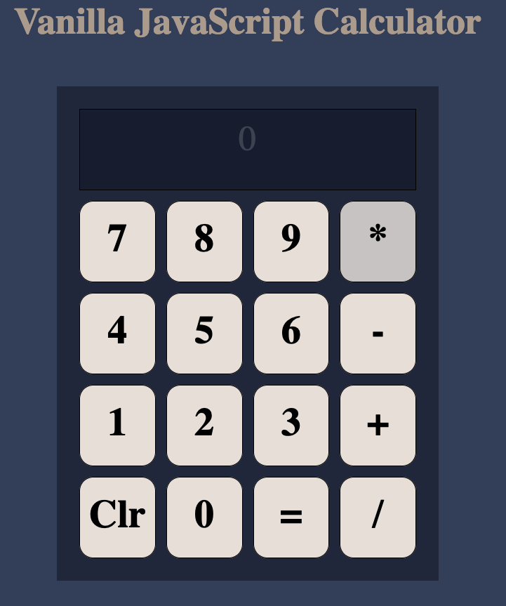

# jsCalculator
---
 

Simple JavaScript calculator built using a class and with the ability to remember results from previous operations.

<a href="https://resdayn.github.io/jsCalculator/">Live Demo</a>